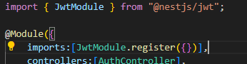
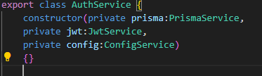
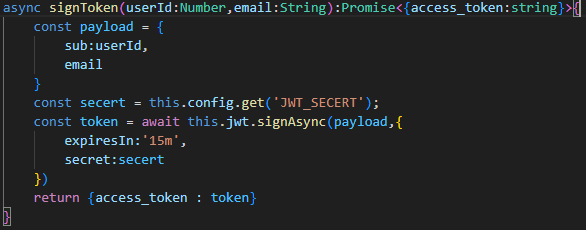
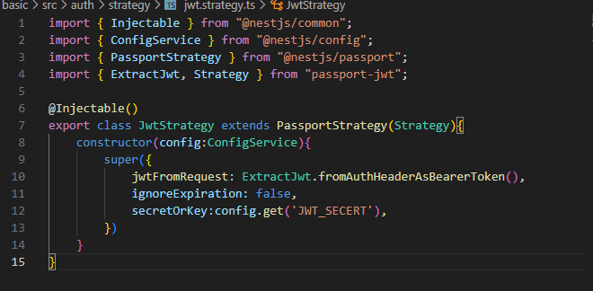
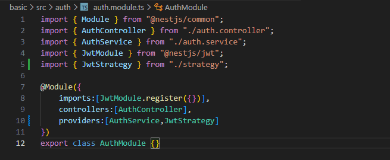

**JWT USING MANUAL**
>For install require module just refer to this documentation
[Link](https://docs.nestjs.com/recipes/passport)

 
**Command**
```
npm install --save @nestjs/passport passport
```

[Link](https://docs.nestjs.com/recipes/passport#jwt-functionality)

**Command**
npm install --save @nestjs/jwt passport-jwt
npm install --save-dev @types/passport-jwt 

## Usage of jwt in auth module
1. Import Jwt in /src/auth/auth.module.ts 



3. Add JWT secret in .env file.

2. Create a jwt in auth service file
> Import Jwt in constructor as private variable so we can use in our all functions in auth service.


3. Create a function to generate JWT token in auth service file.


## Create a strategy for jwt validation
1. Create a folder in src/auth name will be strategy.
2. Create a two files index.ts and jwt.strategy.ts

3. Create a class in jwt.strategy.ts file 
](documentation_images/auth.strategy.strategy.jwt.png)

4. Add this jwtStrategy in auth module file.



